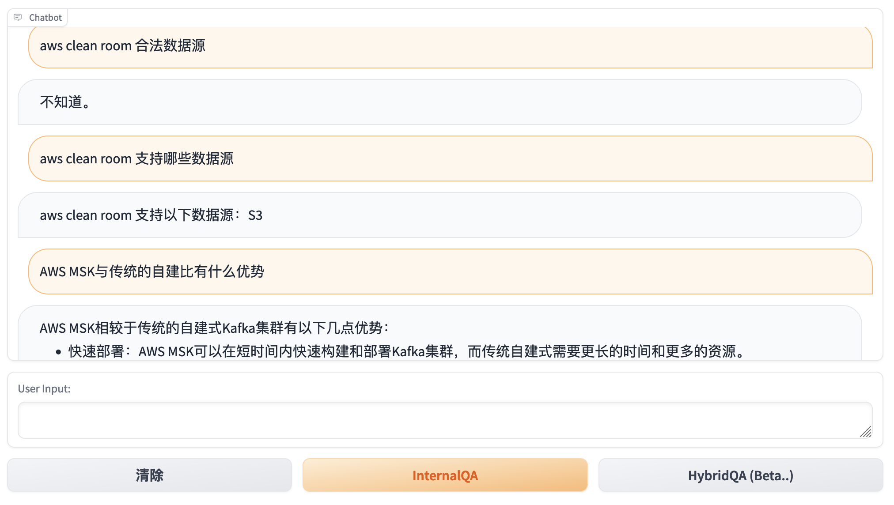

# hybrid-knowledge-base-chain

 \- on AWS
 
#### Sketch Demo

 

#### Current Features:
- Amazon Kendra Index as private Knowledge Base

- Kendra knowledge retrieval

- Private LLM on SageMaker Endpoint with LMI (Large Model Inference) container

- WebSearch as a chain Tool

- 'Hybrid Chain' - Internal Answer + web search => final answer

 

#### Developing:
- Larger model with better understanding of task prompts

- Retrieval similarity filtering

- Description-based Tool retrieving

 

#### References:
- https://aws.amazon.com/cn/blogs/machine-learning/quickly-build-high-accuracy-generative-ai-applications-on-enterprise-data-using-amazon-kendra-langchain-and-large-language-models/

- https://github.com/aws-samples/amazon-kendra-langchain-extensionsa

- https://github.com/imClumsyPanda/langchain-ChatGLM

- https://rapidapi.com/microsoft-azure-org-microsoft-cognitive-services/api/bing-web-search1/

 

#### Licensing

Inherit [LICENSE](LICENSE) from [amazon-kendra-langchain-extensions](https://github.com/aws-samples/amazon-kendra-langchain-extensions)
